# Born2beroot
This is how to build a virtual machine using debian and coding it for the 42 project Born2beroot
==Requirements==
- Virtual Box
- ISO with the latest Debian 64-bit

## Lets get started shall we? 🐉

### 🐲1st - Setting the machine for 42 Students

You should start by going to your home folder,
once you find it search for a folder called "sgoinfre"
create a folder called B2B or your name of preference.

Exemple
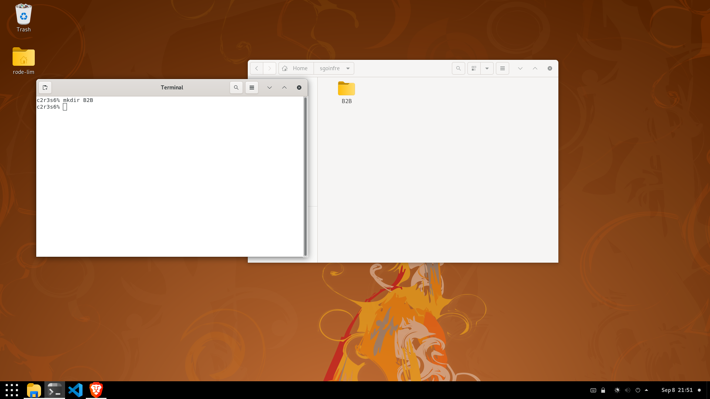

#### Checkpoint 1/4---Next...
Now you should open the app Oracle VM Virtualbox Manager
as ur starting it should have a penguin:
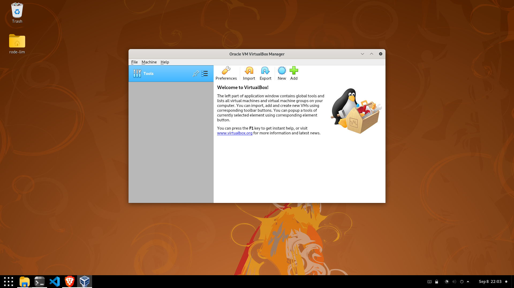

#### Checkpoint 2/4---Important steps...
Make sure now you press [CTRL + N] to make a new machine, change the name to your preference, change the sytem to Linux and then set the Version to DEBIAN (64-Bit)!
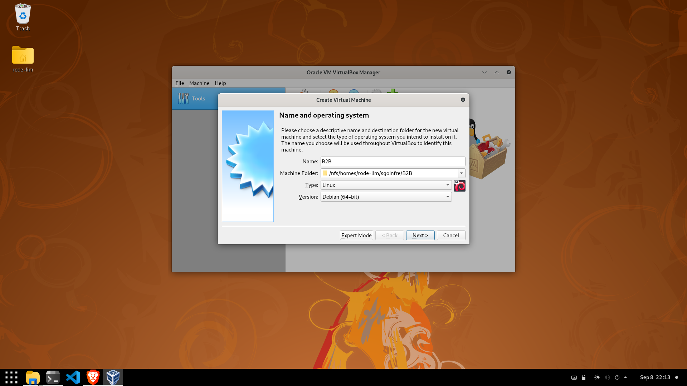

#### Checkpoint 3/4---Follow the pictures...
Make sure you follow the pictures if u are not trying to get the bonus, in case you are trying to get the bonus check other tutorials.
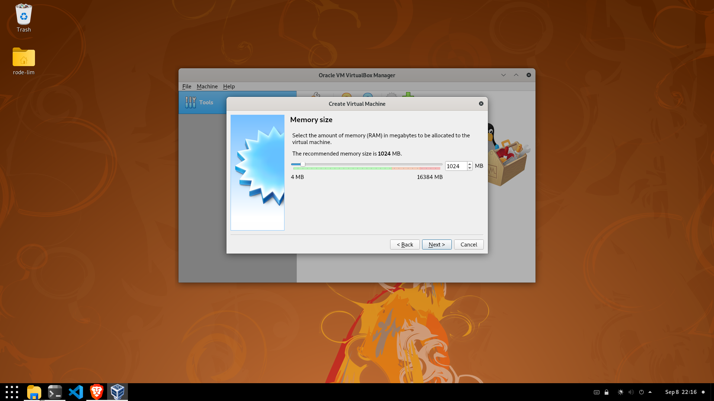
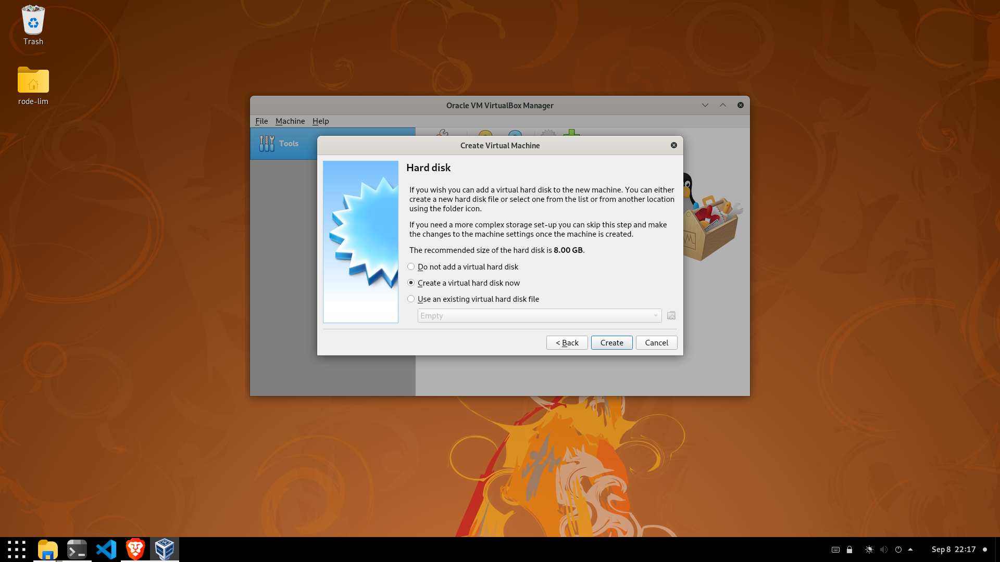
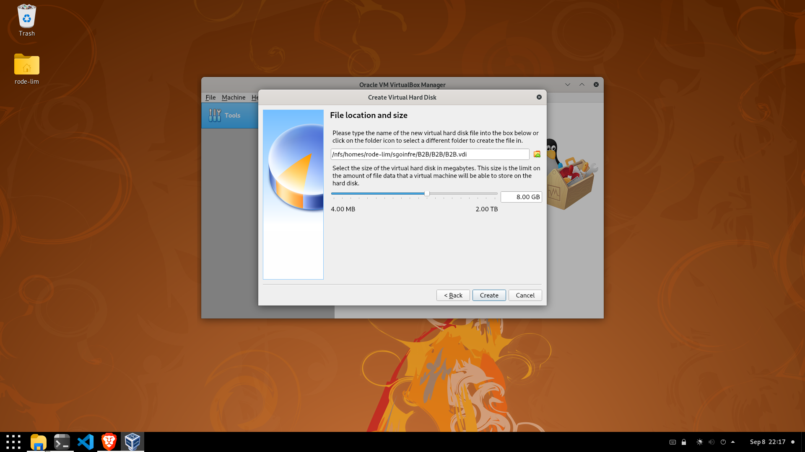
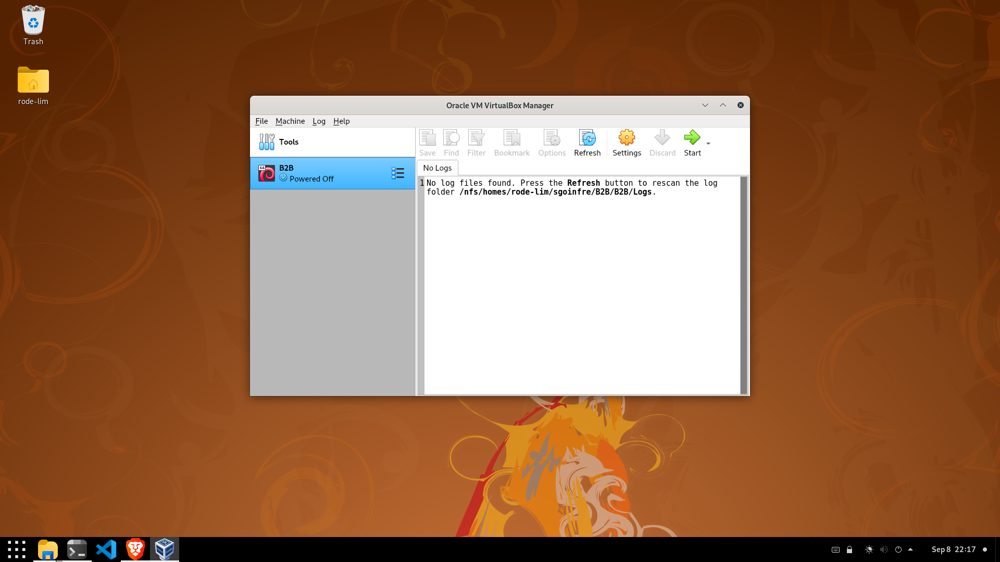

#### Checkpoint 4/4---Placing the System...
Make sure u follow the pictures and read the images.
Press to open the settings (ORANGE GEAR)
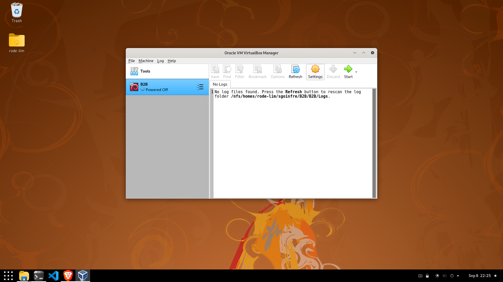
Press storage from the left bar
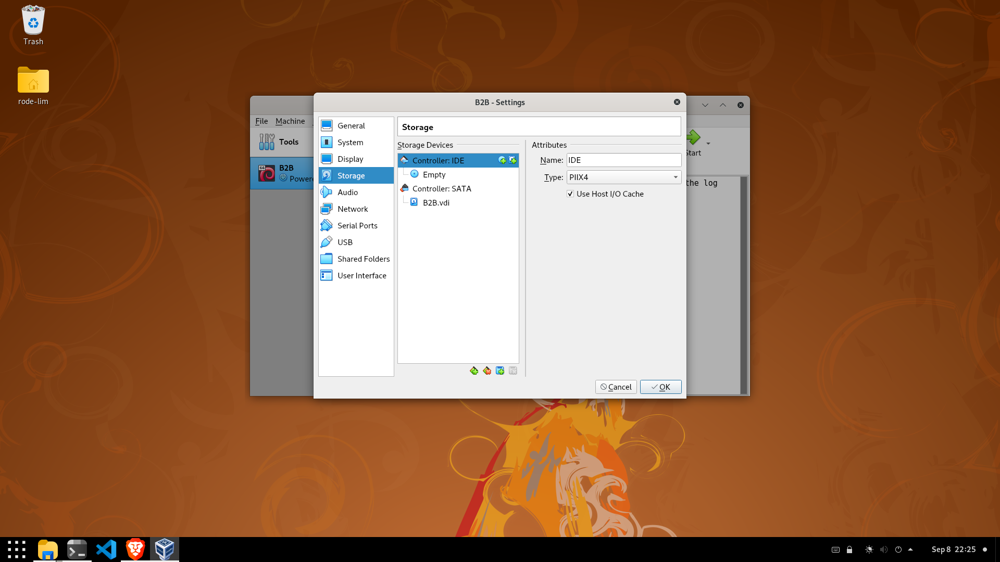
Press the empty disk under Controller IDE

Press the Blue disk at the right of "Optical Drive:" and pick "Choose disk file..."
After finding the right ISO file (List of requirements) press to open it.
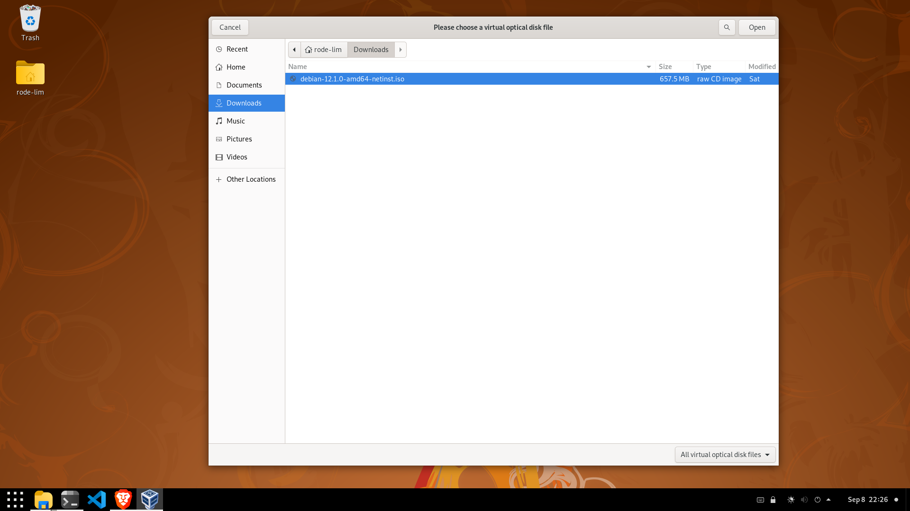
Now press ok and go back to the main page.
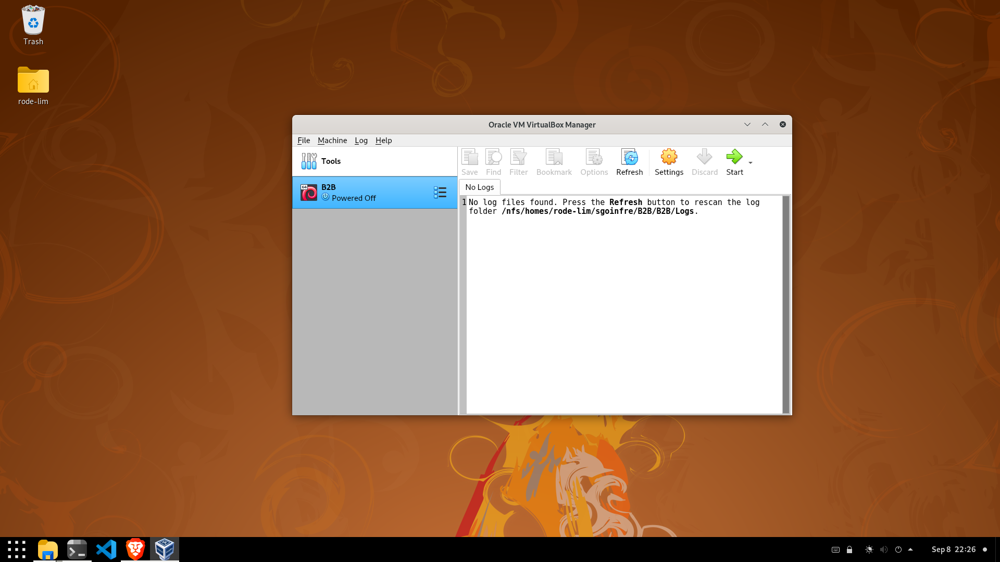

###  🐲2nd - Installing the system

==START THE MACHINE==
PRESS THE GREEN ARROW POINTING TO THE RIGHT (while having your project selected)
